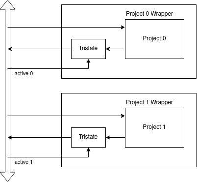
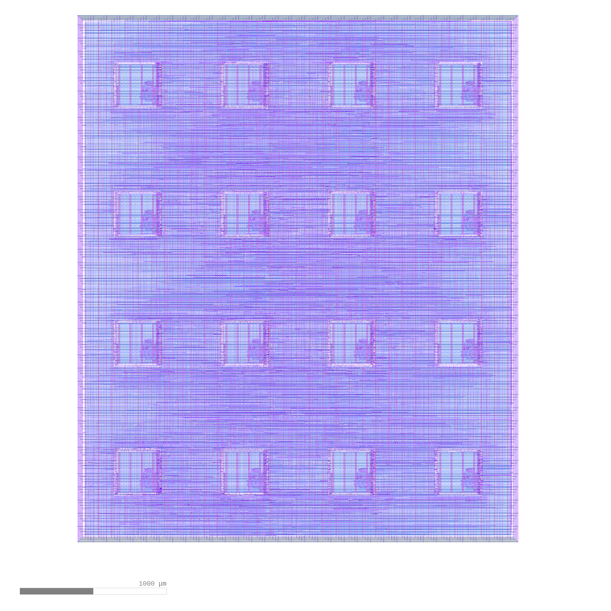

# Multi project tools

A tool to help automate verification of sub projects and collect and harden them into the final submission.

* Project outputs isolated with tristate buffers
* Projects are activated by the Caravel logic analyser

Projects must conform to the [specification](docs/project_spec.md). 

See this [generated index page](index.md) for some example projects.

See this repo you can use as a template: https://github.com/mattvenn/wrapped_project_template

## Schematic

The shared bus contains the following signals:

    // Wishbone
    input wire wb_clk_i,
    input wire wb_rst_i,
    input wire wbs_stb_i,
    input wire wbs_cyc_i,
    input wire wbs_we_i,
    input wire [3:0] wbs_sel_i,
    input wire [31:0] wbs_dat_i,
    input wire [31:0] wbs_adr_i,
    output wire wbs_ack_o,
    output wire [31:0] wbs_dat_o,

    // Logic Analyzer Signals
    input  wire [31:0] la_data_in,
    output wire [31:0] la_data_out,
    input  wire [31:0] la_oen,

    // IOs
    input  wire [`MPRJ_IO_PADS-1:0] io_in,
    output wire [`MPRJ_IO_PADS-1:0] io_out,
    output wire [`MPRJ_IO_PADS-1:0] io_oeb,
   
Each project is connected to one bit of the active bus:

    // active input, only connect tristated outputs if this is high
    input wire active [31:0]

When the active wire goes high, the wrapper's outputs are switched from high-z to the project's outputs.

## Dependencies

* caravel_user_project with OpenLANE & PDK installed as given in instructions.
* projects.yaml file with correct paths
* netgen local install: https://github.com/RTimothyEdwards/netgen (commit 402e1f0f254c6c0cf36c90ff5d6a09134b9196ba for MPW2)- TODO use the one in the OpenLANE docker
* gdspy: https://pypi.org/project/gdspy/

## Config file

[projects.yaml](projects.yaml) contains a list of projects and system wide config.

Some tests now require a recent OpenLANE (tested with v0.9). #TODO make a note why

## Test everything

     ./multi_tool.py --config projects.yaml  --test-all --force-delete

This command will run all the tests against all projects: 

* Check config file
* Runs a module test given Makefile and recipe
* Runs the Caravel simulation given Makefile and recipe
* Runs formal proof on wrapper tristated outputs
* Checks wrapper md5sum is correct (if doing an LVS with gds and powered Verilog, then is there any point in doing md5sum on wrapper?)
* Checks GDS is correct size
* Checks GDS nothing on layer metal 5
* Run LVS against powered Verilog and GDS - requires v0.9 OpenLANE/PDK
* Checks powered Verilog has correct number of tristate buffers
* Checks powered Verilog has correct module interface

This functionality is contained within the [Project class](project.py)

To choose a single project, provide the --directory argument.

## Generate OpenLANE config

    ./multi_tool.py --config projects.yaml  --copy-gds --create-openlane-config --generate-doc

This command will get everything ready for a complete system test and hardening of user_project_wrapper:

* Copy each project's GDS/LEF to the correct place in Caravel
* Generate OpenLANE configuration for user_project_wrapper (macro placement and obstructions)
* Instantiate all the projects inside user_project_wrapper.v
* Generate documentation in index.md

This functionality is contained within the [Collection class](collect.py)

## Done by hand

run OpenLANE to harden user_project_wrapper:

    cd $CARAVEL_ROOT; make user_project_wrapper

The above was generated with config created by this command that fills all 16 slots with repeated projects:

    ./multi_tool.py --copy-gds  --create-openlane-config --fill 16 --force-delete

* Caravel was installed by caravel_user_project (599c0a77f2a8c40dbccdd604ea3ce08f2f8dc0a8)
* OpenLANE was rc0.12 (as installed by caravel_user_project)
* took 13minutes to complete on 3GHz with 4 cores and 32GB RAM.
* LVS & DRC clean
* main config adjustment was GLB_RT_ADJUSTMENT set to 0.8

## TODO

* put tool command that generated config into the readme
* put gds image into the readme
* test with vga_clock - as it uses .hex files. will probably break the include system
* template repository with everything in the right place and a default yaml
* fetch projects from a git ref
* check license in projects
* one of the tests make a results.xml in local directory
* tries to use caravel/openlane/user_project_wrapper/macros/{gds|lef} which are things I do but not part of caravel
