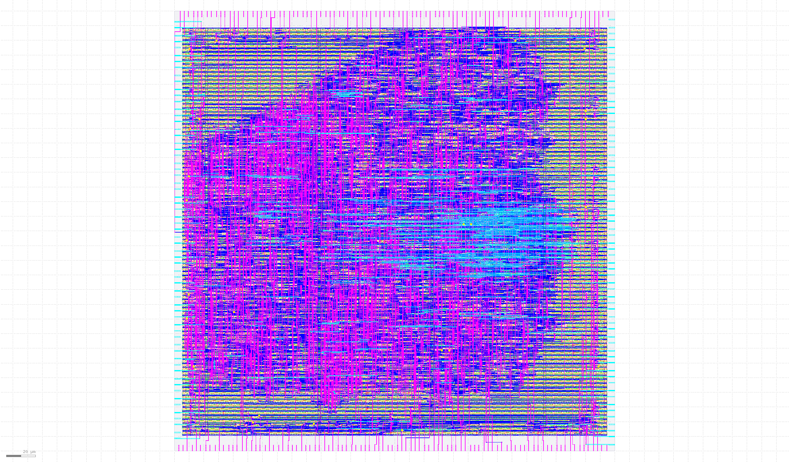
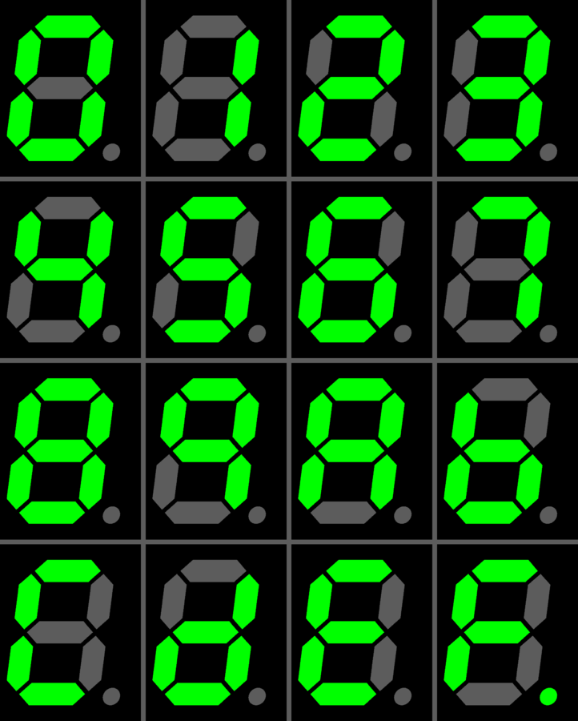

# Multi Project Index

This index was made with [multi project tools](https://github.com/mattvenn/multi_project_tools)

## RGB Mixer

* Author: Matt Venn
* Github: [https://github.com/mattvenn/wrapped_rgb_mixer/tree/caravel](https://github.com/mattvenn/wrapped_rgb_mixer/tree/caravel)

reads 3 encoders and generates PWM signals to drive an RGB LED

## Frequency counter

* Author: Matt Venn
* Github: [https://github.com/mattvenn/wrapped_frequency_counter](https://github.com/mattvenn/wrapped_frequency_counter)

Counts pulses on input and displays frequency on 2  seven segment displays

## A5/1 Wishbone

* Author: Jamie Iles
* Github: [https://github.com/mattvenn/a5-1-wb-macro/tree/multi_proj_tools](https://github.com/mattvenn/a5-1-wb-macro/tree/multi_proj_tools)

A5/1 cryto block connected via wishbone to PicoRV32

## Seven Segment Seconds

* Author: Matt Venn
* Github: [https://github.com/mattvenn/seven_segment_wrapper](https://github.com/mattvenn/seven_segment_wrapper)

Very simple demo project that counts seconds on a seven segment display

