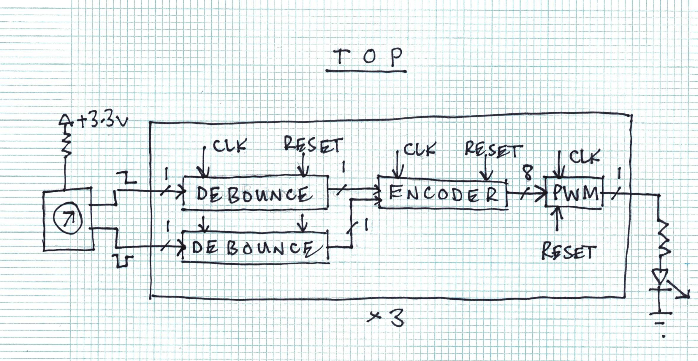
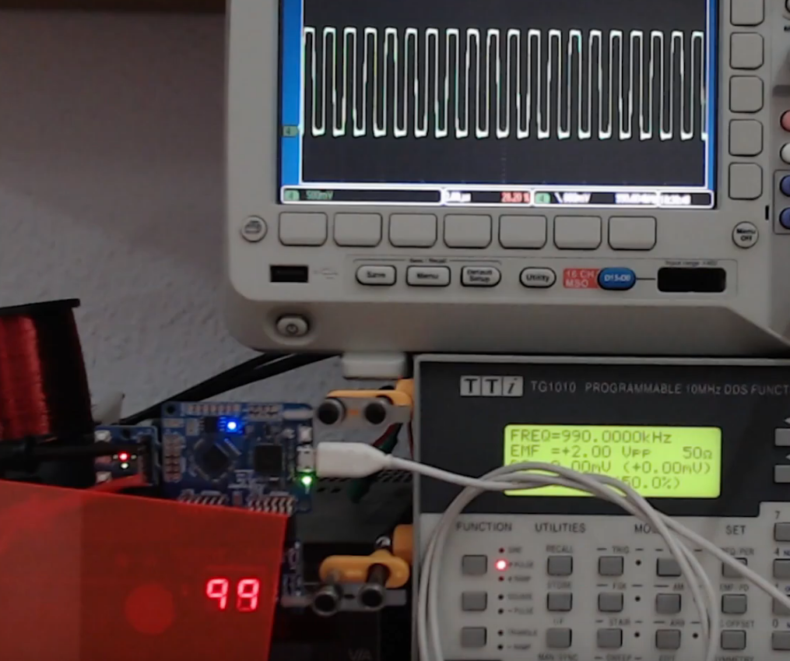

# Multi Project Index

This index was made with [multi project tools](https://github.com/mattvenn/multi_project_tools)

## RGB Mixer

* Author: Matt Venn
* Github: [https://github.com/mattvenn/wrapped_rgb_mixer/tree/caravel-mpw2](https://github.com/mattvenn/wrapped_rgb_mixer/tree/caravel-mpw2)
* Description: reads 3 encoders and generates PWM signals to drive an RGB LED

## Frequency counter

* Author: Matt Venn
* Github: [https://github.com/mattvenn/wrapped_frequency_counter/tree/caravel-mpw2](https://github.com/mattvenn/wrapped_frequency_counter/tree/caravel-mpw2)
* Description: Counts pulses on input and displays frequency on 2  seven segment displays

